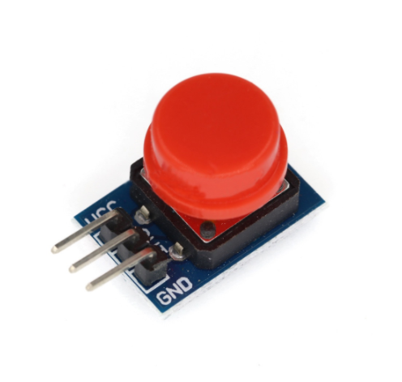
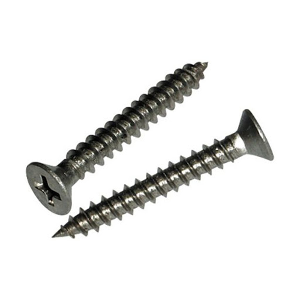
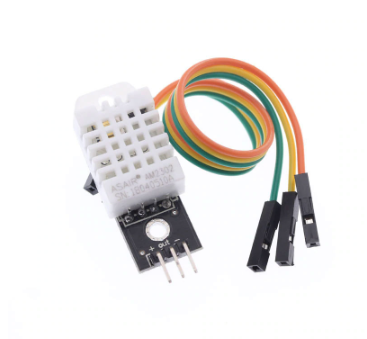
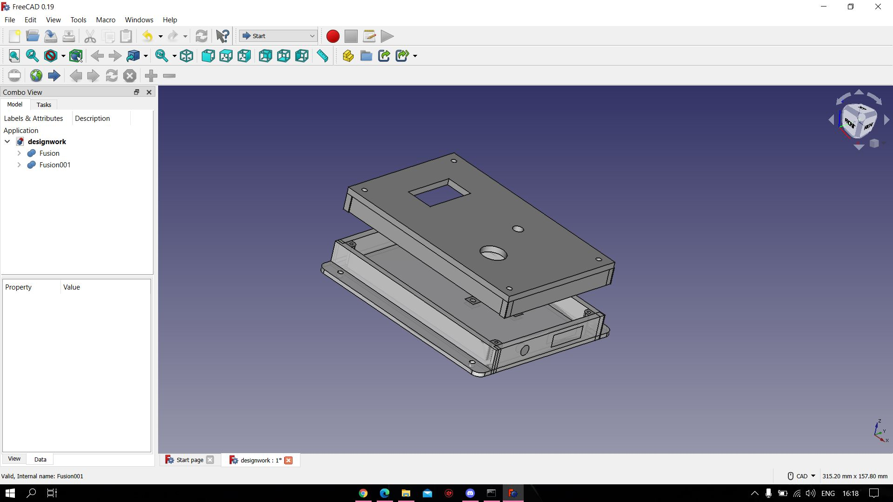
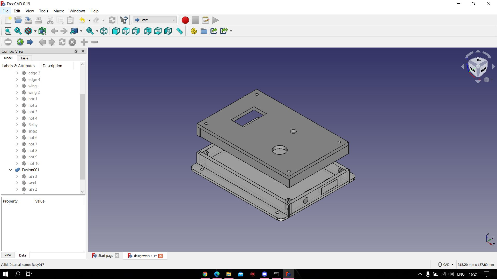
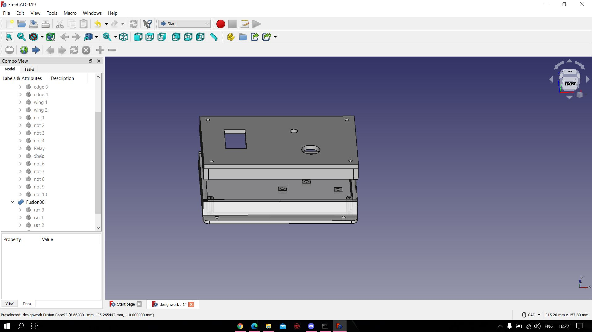
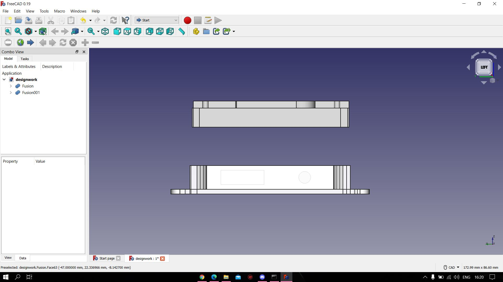
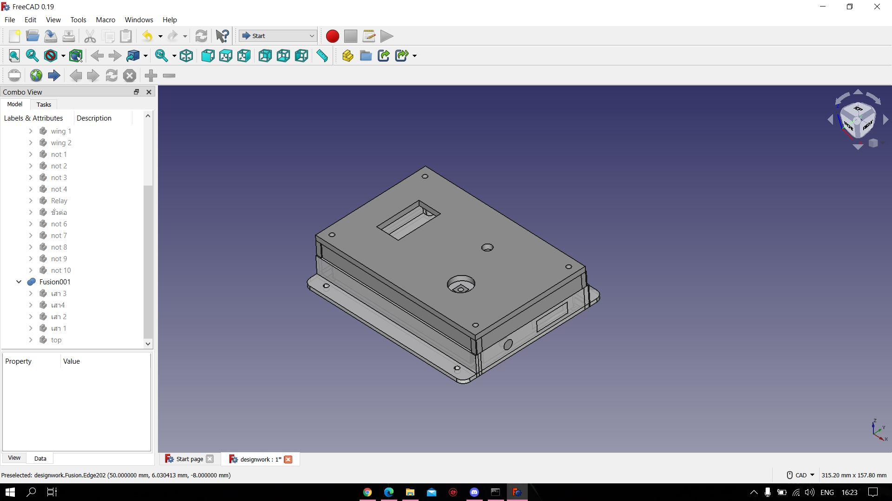

<h1>TempHumidsBox</h1>

โจทย์การบ้าน

<h1>อุปกรณ์</h1>  

Breadboard สำหรับใส่ NodeMCU v.2 (ESP8266)

ขนาด : 46mm. x 35mm.

<a href="https://www.arduino4.com/product/183/mini-breadboard-%E0%B8%9A%E0%B8%AD%E0%B8%A3%E0%B9%8C%E0%B8%94%E0%B8%97%E0%B8%94%E0%B8%A5%E0%B8%AD%E0%B8%87%E0%B8%82%E0%B8%99%E0%B8%B2%E0%B8%94%E0%B9%80%E0%B8%A5%E0%B9%87%E0%B8%81-170-holes">This is a link</a>
  

ชุดเปิด/ปิดไฟ 1 ช่องทาง (1 Ch. Relay Module)

ขนาด : 4.2 x 2.6 x 1.8cm.

<a href="https://shopee.co.th/3Vdc-Relay-Module--1-Channel--i.132454846.6317288773?gclid=Cj0KCQjwssyJBhDXARIsAK98ITSTbTrqiySkUXGqc3FEbjNzdiusM0mOwrT57KOdIOGrkTqwpDc0JGAaAhsrEALw_wcB">This is a link</a>
  

ปุ่มกด (Push Switch)
  
  

ขนาด : 12mm. x 12mm.
    
<a href="https://shopee.co.th/Queen-2pcs-Big-Button-Button-Module-Big-Key-Button-Light-Touch-Switch-12mmx12mm-Hat-Output-Module-For-Arduino-i.22190646.6093923062?gclid=Cj0KCQjwssyJBhDXARIsAK98ITTCR3zka0bBjTx35GNgxiNoT6Vb1rHQqrx8VbwHBM8i88X5cqBluf8aAmCmEALw_wcB"> This is a link</a>  
  

หลอดไฟ(LED) ขนาด 5mm.
  
 

ขนาด : 5mm.
      
<a href="https://shopee.co.th/Queen-2pcs-Big-Button-Button-Module-Big-Key-Button-Light-Touch-Switch-12mmx12mm-Hat-Output-Module-For-Arduino-i.22190646.6093923062?gclid=Cj0KCQjwssyJBhDXARIsAK98ITTCR3zka0bBjTx35GNgxiNoT6Vb1rHQqrx8VbwHBM8i88X5cqBluf8aAmCmEALw_wcB"> This is a link</a>    
  

ขั้วต่อไปเลี้ยงแบบกลม
    
 

ขนาด : 3.7 mm.

<a href="https://www.lazada.co.th/products/js-910b-37-1-i899960679-s1817174327.html?exlaz=d_1:mm_150050845_51350205_2010350205::12:12654756915!117524295342!!!pla-294682000766!c!294682000766!1817174327!135253431&gclid=Cj0KCQjwssyJBhDXARIsAK98ITR1MCnF94tveQ1Qvz00456ZXcG89rLSUP0R-mrSYsodgyDPuh--RJ4aAidCEALw_wcB"> This is a link</a>   
  

น็อต M2 - M3
    
   

ขนาด : M2 1.5mm. - M3 2.5mm.
  
<a href="http://www.dojogarden.com/index.php?id_product=84&controller=product"> This is a link</a>     
 

DHT22 ตัวตรวจวัดอุณหภูมิและความชื้น
    
   

ขนาด : 28.2mm. x 13.1mm. x 10mm.
  
<a href="https://www.robotsiam.com/product/151/dht22-temperature-and-humidity-sensor-pcb"> This is a link</a>    
  
<h1>Model งาน</h1>

ตัวอย่างการสร้างกล่องใส่อุปกรณ์
       
 

Detail
      

ผมจะแบ่งเป็นสองส่วนคือ ส่วนบน Fusion เป็นฝาปิดด้านบนและอีกส่วนคือ Fusion001 เป็นฐานล่างครับ
    

ขนาดของฐานล่าว และ ฝาปิด : 100mm. x 65mm.

ขนาดของขอบฐาน : 100mm. x 12mm. x 100mm. x 12mm.

ขนาดขอบฝาปิด : 100mm. x 8mm. x 100mm. x 8mm.

ขนาดของรูขั้วต่อไปเลี้ยงแบบกลม : 5mm.

ขนาดของ Button : 12mm.
    

ขนาดของ DHT : 25mm. x 13.5mm.

ขนาด LED: 5mm.
  

ขนาดรูต่อไฟ Relay: 18mm. x 6mm.
  

รูน็อตเชื่อม Relay: 2.5mm.

รูน็อตเชื่อมกล่อง: 1.5mm.

รูน็อตเอาไว้เชื่อมบนฝาผนัง: 2.6
 
  
<h1>Model example</h1>

ภาพรวมชิ้นงาน
  
   

ภาพรวมชิ้นงานข้างบน
  
   

ภาพรวมชิ้นงานด้านข้าง
  
   
  

ภาพรวมชิ้นงานด้านขวา
  
   

ภาพรวมชิ้นงานตอนประกอบรวม
  
   

  
  

  
  
  

  
  
